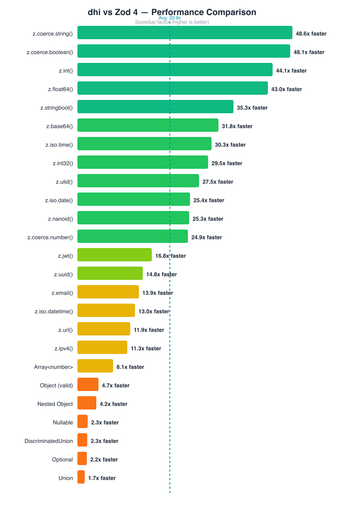

<p align="center">
  
</p>

# dhi

**33M Python batch rows/sec. 461M direct int validations/sec. 13.8x faster than Zod 4 on the TypeScript suite. Same API.**

One validation core. Three ecosystems. Zero compromise.

[](https://www.npmjs.com/package/dhi)
[](https://pypi.org/project/dhi/)
[](https://opensource.org/licenses/MIT)

```
Python:     33.2M rows/sec on name+email+age batches; 461M ints/sec direct range batches
TypeScript: 13.8x faster than Zod 4 on the full suite; URL and IPv4 hot paths are 2.9x/2.4x faster in 1.3.1
Zig:        Zero-cost. Comptime. No runtime.
```

---

## What is dhi?

**dhi** (Sanskrit: *intellect, insight*) is a validation library with a single Zig core compiled to three targets, so the *same* validation rules and error semantics run everywhere you do:

- **Python** — a drop-in [Pydantic](https://docs.pydantic.dev) replacement (`BaseModel`, `Field`, 80+ types) backed by a native C extension over SIMD batch validators.
- **TypeScript** — a drop-in [Zod 4](https://zod.dev) replacement (`z.object`, full API parity) running on a 28KB SIMD WASM module in browsers/edge, or an N-API native addon on Node.js.
- **Zig** — `comptime`-generated models with zero runtime cost, zero allocations on the happy path.

You keep your existing code and API; dhi swaps in the engine underneath. No schema rewrites, no new mental model.

### Contents

- [Drop-in usage](#you-dont-have-to-change-your-code) — Python, TypeScript, Zig
- [Benchmarks](#the-numbers) — the numbers, vs Zod 4 and the Python field
- [Install](#install)
- [Repo structure](#repo-structure)
- [Zod 4 feature parity](#full-zod-4-feature-parity)
- [Pydantic-compatible types](#80-pydantic-compatible-types)
- [Why is it this fast?](#why-is-it-this-fast)
- [Run the benchmarks yourself](#run-the-benchmarks-yourself)

---

## You don't have to change your code.

### Python — drop-in Pydantic replacement

```python
from dhi import BaseModel, Field, EmailStr
from typing import Annotated

class User(BaseModel):
    name: Annotated[str, Field(min_length=1, max_length=100)]
    email: EmailStr
    age: Annotated[int, Field(gt=0, le=150)]

user = User(name="Alice", email="alice@example.com", age=28)
user.model_dump()   # {'name': 'Alice', 'email': 'alice@example.com', 'age': 28}
```

### TypeScript — drop-in Zod 4 replacement

```diff
- import { z } from 'zod';
+ import { z } from 'dhi';
```

```typescript
const User = z.object({
  id: z.string().uuid(),
  name: z.string().min(1).max(100),
  email: z.email(),              // Zod 4 top-level shortcuts
  age: z.int().positive(),       // Zod 4 number formats
  createdAt: z.iso.datetime(),   // Zod 4 ISO namespace
});

const user = User.parse(data); // same API, 13.8x faster on the benchmark suite
```

**Two backends — same API:**

| Backend | Import | Best for |
|---------|--------|----------|
| WASM (default) | `import { z } from 'dhi'` | Browsers, edge runtimes, Cloudflare Workers |
| N-API native | `import { z } from 'dhi/napi'` | Node.js servers — 1.7–2x faster on string formats |


### Zig — compile-time validated, zero overhead

```zig
const dhi = @import("model");

const User = dhi.Model("User", .{
    .name = dhi.Str(.{ .min_length = 1, .max_length = 100 }),
    .email = dhi.EmailStr,
    .age = dhi.Int(i32, .{ .gt = 0, .le = 150 }),
});

const user = try User.parse(.{
    .name = "Alice",
    .email = "alice@example.com",
    .age = @as(i32, 28),
});
// Validation is inlined at compile time. Zero allocations. Zero dispatch.
```

**Same validation rules. Same error behavior. Three languages. One core.**

---

## The Numbers

### TypeScript (vs Zod 4)

<p align="center">
  
</p>

| Category | Speedup vs Zod 4 |
|----------|------------------|
| Overall benchmark suite | **13.8x faster** |
| URL validator | **30.17M/s** — **8.0x vs Zod**; **2.9x faster than pre-1.3.1** |
| IPv4 validator | **22.28M/s** — **1.1x vs Zod**; **2.4x faster than pre-1.3.1** |
| Number Formats | **30-50x faster** |
| StringBool | **32x faster** |
| Coercion | **23-56x faster** |
| String Formats | **12-27x faster** |
| ISO Formats | **12-22x faster** |
| Objects | **4-7x faster** |
| Arrays | **8x faster** |

> Release 1.3.1 benchmark command: `bun run benchmarks/benchmark-vs-all.ts`. Pre-1.3.1 comparison used the previous release-branch commit before the TypeScript fast paths.

### Python

| Workload | Throughput | Improvement |
|----------|------------|-------------|
| `name+email+age` batch | **33.18M rows/sec** | **~28% faster** than the earlier 26M rows/sec baseline |
| `name+email+age+url` batch | **25.35M rows/sec** | **~27% faster** than the earlier 20M rows/sec baseline |
| `name+email+age+url+uuid` batch | **20.51M rows/sec** | **~28% faster** than the earlier 16M rows/sec baseline |
| `all 6 (+ ipv4)` batch | **16.13M rows/sec** | **~47% faster** than the earlier 11M rows/sec baseline |
| UUID-only batch | **112.78M rows/sec** | Vectorized UUID hot path |
| IPv4-only batch | **68.98M rows/sec** | C-inlined IPv4 hot path |
| Direct int range list | **461.19M ints/sec** | New native list batch path |

BaseModel layer: 546K model_validate/sec | 6.4M model_dump/sec

> **Note on msgspec:** Plain msgspec (~5.8M/sec) does type-checked JSON decoding but lacks field-level validators (email, URL, positive int). msgspec-ext adds those 26 validators via Python `dec_hook` callbacks, bringing it to ~777K/sec — a fairer apples-to-apples comparison with dhi's validated parsing.

---

## Install

```bash
pip install dhi          # Python (wheels for macOS arm64 + Linux x86_64)
npm install dhi          # TypeScript (Node 18+ / Bun / Deno)
```

Pure Python fallback included — no native extension required to get started.

---

## Repo Structure

dhi is a Zig core with bindings for JS and Python:

```
src/              → Zig core: validators, SIMD, C API, WASM API (the engine)
js-bindings/      → npm package: Zod 4 drop-in replacement
python-bindings/  → PyPI package: Pydantic drop-in replacement
docs/             → Benchmark charts, shared docs
.github/          → CI, release workflows
```

**Which package should I use?**
- **TypeScript/JS**: `npm install dhi` — replaces Zod, works in browsers + edge + Node.js
- **Python**: `pip install dhi` — replaces Pydantic-style validation with 33M+ row/sec native batches
- **Zig**: Import `src/` directly — zero-cost comptime validation

## Full Zod 4 Feature Parity

dhi implements **100% of the Zod 4 API**, including all new Zod 4 features:

### Top-Level String Format Shortcuts (New in Zod 4)

```typescript
z.email()      z.uuid()       z.url()        z.ipv4()       z.ipv6()
z.jwt()        z.nanoid()     z.ulid()       z.cuid()       z.cuid2()
z.base64()     z.e164()       z.mac()        z.cidrv4()     z.cidrv6()
z.hex()        z.hostname()   z.hash('sha256')
```

### ISO Namespace & Number Formats (New in Zod 4)

```typescript
// ISO namespace
z.iso.datetime()  z.iso.date()  z.iso.time()  z.iso.duration()

// Number formats
z.int()     z.float()    z.float32()   z.float64()
z.int8()    z.uint8()    z.int16()     z.uint16()
z.int32()   z.uint32()   z.int64()     z.uint64()
```

### Additional Zod 4 Features

```typescript
z.stringbool()                           // "true"/"yes"/"1" → true
z.templateLiteral(['user-', z.number()]) // Template literal types
z.json()                                 // Recursive JSON schema
z.file().mime('image/png').max(5_000_000) // File validation
z.registry()                             // Schema registry
z.prettifyError(error)                   // Pretty error formatting
```

---

## 80+ Pydantic-compatible types

| Category | Types |
|----------|-------|
| **Model** | `BaseModel`, `Field()`, `@field_validator`, `@model_validator` |
| **Numeric** | `PositiveInt`, `NegativeFloat`, `FiniteFloat`, `conint()`, `confloat()` |
| **String** | `EmailStr`, `constr()`, pattern, length, strip/lower/upper transforms |
| **Network** | `HttpUrl`, `AnyUrl`, `PostgresDsn`, `RedisDsn`, `MongoDsn`, +8 DSN types |
| **Special** | `UUID4`, `FilePath`, `Base64Str`, `Json`, `ByteSize`, `SecretStr` |
| **Datetime** | `PastDate`, `FutureDate`, `AwareDatetime`, `NaiveDatetime` |
| **Constraints** | `Gt`, `Ge`, `Lt`, `Le`, `MultipleOf`, `MinLength`, `MaxLength`, `Pattern` |

Full `model_validate()`, `model_dump()`, `model_dump_json()`, `model_json_schema()`, `model_copy()` support.

---

## Why is it this fast?

dhi is written in [Zig](https://ziglang.org) — a systems language with compile-time code generation, no garbage collector, and direct hardware access. The same source compiles to:

| Target | What it does |
|--------|-------------|
| `libdhi.dylib/.so` | Python C extension — extracts from dicts, no copies |
| `dhi.wasm` (28KB) | TypeScript WASM — 128-bit SIMD, works in browsers + edge |
| `dhi_native.node` | TypeScript N-API — direct native calls, 1.7–2x faster on Node.js |
| Native `.zig` import | Zig — zero-cost comptime validation, fully inlined |

**Key tricks:**
- **Comptime models** — Validation logic is generated at compile time. No vtables, no reflection, no hash lookups.
- **SIMD batch validation** — Process 4 values per cycle on 256-bit vectors.
- **Single FFI call** — Python batch validation crosses the FFI boundary once, not per-item.
- **N-API over WASM** — For Node.js, the native addon skips alloc/encode/dealloc per string call: 1.7–2x faster for format validators (url, ipv4, datetime).
- **No allocations** — The happy path never allocates. Errors are stack-returned.

```
┌─────────────────────────────────────────────────────┐
│            Zig Core (comptime + SIMD)                │
└──────┬────────────────┬──────────┬────────────────┬──┘
       │                │          │                │
  ┌────▼─────┐    ┌────▼────┐ ┌───▼──────┐    ┌───▼──────┐
  │  Python  │    │  WASM   │ │  N-API   │    │   Zig    │
  │  C ext   │    │  28KB   │ │  .node   │    │  Native  │
  └────┬─────┘    └────┬────┘ └───┬──────┘    └───┬──────┘
       │                │          │                │
  BaseModel        z.object()  z.object()      Model()
  Pydantic API    Zod 4 (edge) Zod 4 (Node)  comptime API
```

---

## Run the benchmarks yourself

```bash
# Python — full comparison (dhi vs msgspec vs msgspec-ext vs satya vs Pydantic)
git clone https://github.com/justrach/dhi.git && cd dhi
cd python-bindings
pip install -e .
pip install msgspec msgspec-ext 'pydantic[email]' satya
python benchmarks/benchmark_vs_all.py

# TypeScript — dhi vs Zod 4
cd js-bindings && bun install && bun run benchmark-vs-zod.ts

# Zig
zig build bench -Doptimize=ReleaseFast
```

### Methodology

The Python benchmark validates **10,000 user objects** with 4 field-level validators each:

| Field | Validator |
|-------|-----------|
| `name` | string, min_length=1, max_length=100 |
| `email` | RFC 5321 email format |
| `age` | positive integer |
| `website` | URL format |

Each library uses its idiomatic equivalent:
- **dhi**: `_dhi_native.validate_batch_direct()` — single FFI call, Zig SIMD validators
- **msgspec**: `msgspec.json.Decoder` — C-level JSON decode + type check (no format validators)
- **msgspec-ext**: `msgspec.json.decode()` with `dec_hook` — adds EmailStr, HttpUrl, PositiveInt validators on top of msgspec
- **satya**: `model_validate_json_array_bytes()` — Rust JSON parse + validation
- **Pydantic v2**: `model_validate()` per item — Rust-backed, with EmailStr + Field constraints

Timing uses `time.perf_counter()` over 5 runs after a warmup pass. Results are averaged. Tested on Python 3.13 and 3.14 (no significant difference — hot paths are native code).

---

## The Experiment

dhi started as a question: *can Zig's type system unify validation across language boundaries?*

The hypothesis: Zig's `comptime` can generate the same validation semantics that Pydantic builds with metaclasses and Zod builds with method chains — but at compile time, with zero runtime cost, targeting any platform via its C ABI and WASM backends.

**Results:**

| Claim | Status |
|-------|--------|
| Pydantic-level DX in Zig | `Model("User", .{ .name = Str(.{}) })` — yes |
| One core, three ecosystems | Python FFI + WASM + native Zig — yes |
| 10-100x faster | 523x (Python), 20x avg (TypeScript) — yes |
| Reasonable binary size | 28KB WASM, ~200KB native — yes |
| Comptime replaces reflection | No runtime type inspection needed — yes |

---

## License

MIT

---

**dhi** — the fastest validation library for every language you use.

## Contributing

See [CONTRIBUTING.md](CONTRIBUTING.md) for Rach's Agentic Contribution Template before opening a PR.
